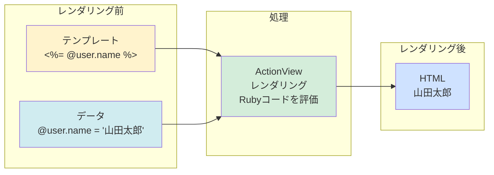
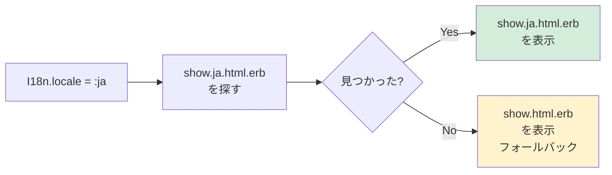

# ゴール
この記事では、RailsのActionViewについてざっくり理解することを目指します⭐️
Railsのなかで、ActionViewがどのような役割を果たしているのかを理解し、基本的な使い方や概念についてイメージできる状態になることを目標とします🙋


# ActionViewとは？
ActionViewは、RailsのMVCアーキテクチャにおける「**View**」の役割を担うコンポーネントです。Viewは、ユーザーに表示される部分を担当し、HTMLテンプレートのレンダリングやデータの表示を行います！

下記の図でいうと、7〜8番にあたります！


**レスポンスの流れ（7〜8番）**

- `Controller`：「このデータを使ってHTMLを作ってほしい🙏」と`ActionView`に依頼する。

- `ActionView`：「了解🙆」と、HTMLを生成（レンダリング）し、その結果（HTMLのソースコード）を`Controller`に戻す。

- `Controller`：「ありがとう👍ブラウザへの返答準備完了」として、HTTPヘッダー（ステータスコード200 OKなど）を付けて、ブラウザに返却（レスポンス）する。

:::note warn
**ActionViewからブラウザにHTMLを直接渡さないの？？**

`ActionView`はあくまで「HTMLを作って、それを`Controller`に渡す」役割であり、実際にブラウザに返すのは`Controller`の役割です。

`ActionView`が直接ブラウザにHTMLを渡さない理由としては、HTTPレスポンスにはHTML以外にもステータスコードやヘッダー情報などが必要であり、これらを一括して管理・返却するの`Controller`の責任範囲だからです。

`ActionView`はHTML生成に専念し、`Controller`がHTTPレスポンス全体を構築・管理することで、役割分担が明確になり、コードの保守性が向上します⭕️

:::

**ActionView レンダリングのイメージ**




# ActionViewの主な構成要素
`ActionView`は、以下のような主要な構成要素から成り立っています！
1. テンプレート：各ページのメインコンテンツ
2. レイアウト：全ページ共通の枠組み
3. パーシャル：再利用可能なビューコンポーネント
4. ヘルパーメソッド：ビューで使う便利なメソッド群

**ファイル構成の例**
```
app/
└── views/
    ├── layouts/
    │   ├── application.html.erb      ← レイアウト
    │   └── admin.html.erb
    │
    ├── shared/                        ← 共通パーシャル
    │   ├── _header.html.erb
    │   ├── _footer.html.erb
    │   └── _flash_messages.html.erb
    │
    └── users/                         ← コントローラーごとのビュー
        ├── index.html.erb             ← テンプレート
        ├── show.html.erb              ← テンプレート
        ├── new.html.erb               ← テンプレート
        ├── edit.html.erb              ← テンプレート
        ├── _form.html.erb             ← パーシャル
        └── _user_card.html.erb        ← パーシャル

app/
└── helpers/
    ├── application_helper.rb          ← 全体で使えるヘルパー
    └── users_helper.rb                ← Usersコントローラー用ヘルパー
```

## テンプレート
テンプレートは、ビューの主要な部分を構成しHTMLと埋め込みRubyコード（ERB）を組み合わせて記述されます。テンプレートファイルは通常、`app/views`ディレクトリ内に配置され、`app/views/コントローラー名/アクション名.html.erb`のような命名規則に従います。

```erb
<!-- app/views/users/show.html.erb -->
<div class="user-profile">
  <h1><%= @user.name %></h1>
  <p><%= @user.email %></p>
</div>
```

## レイアウト
全ページ共通の枠組み（ヘッダー、フッター、メタタグなど）を定義します！

**特徴**
- `app/views/layouts`ディレクトリに配置される
- `yield`で各ページのコンテンツが挿入される
- コントローラーごとに異なるレイアウトを指定可能

```erb
<!-- app/views/layouts/application.html.erb -->
<!DOCTYPE html>
<html>
  <head>
    <title>My App</title>
    <%= csrf_meta_tags %>
    <%= stylesheet_link_tag 'application' %>
  </head>
  <body>
    <%= render 'shared/header' %>
    
    <main>
      <%= yield %>  <!-- ここに各ページの内容が入る -->
    </main>
    
    <%= render 'shared/footer' %>
  </body>
</html>
```

## パーシャル
再利用可能なビューの部品（部分テンプレート）です！

パーシャルをビューの一部に含めてレンダリングするには、`render`メソッドで呼び出します。

```erb
<!-- app/views/users/_user_card.html.erb -->
<div class="user-card">
  <h3><%= user.name %></h3>
  <p><%= user.email %></p>
</div>

<!-- 呼び出し側 -->
<%= render 'users/user_card', user: @user %>
```

:::note info
**パーシャルのファイル名に注意！**
パーシャルは便利ですが、ファイル名の付け方に注意が必要です。
パーシャルのファイル名はアンダースコア（`_`）で始める必要があります。

例：`_form.html.erb`、`_header.html.erb`、`_footer.html.erb`
:::

## ヘルパーメソッド
ビューで使う便利なメソッド群です！Railsには多くの組み込みヘルパーが用意されており、リンク生成、フォーム作成、日付フォーマットなど、様々な操作を簡単に行えます🙆

```erb
<%= link_to 'ホーム', root_path %>
<%= form_with model: @user do |form| %>
  <%= form.label :name %>
  <%= form.text_field :name %>
  <%= form.submit '保存' %>
<% end %>
```

## ローカライズされたビュー
`ActionView`は、現在のロケール（言語設定）に応じて、異なるテンプレートを自動的に選択してレンダリングできます！

**基本的な仕組み**
ファイル名にロケールコードを付けるだけで、言語ごとに異なるビューを表示できます。
(`public`ディレクトリのエラーページも同様の仕組みです)

```erb
app/views/articles/
├── show.html.erb        ← デフォルト
├── show.ja.html.erb     ← 日本語版
└── show.en.html.erb     ← 英語版
└── show.ko.html.erb     ← 韓国語版

public/
├── 404.html          ← デフォルトの404エラーページ
├── 404.ja.html       ← 日本語版404エラーページ
├── 404.en.html       ← 英語版404エラーページ
└── 404.ko.html       ← 韓国語版404エラーページ
```


**ローカライズのイメージ**



## ActionViewの利用に必要な準備
`ActionView`はRailsフレームワークの一部として提供されているため、通常は個別にインストールする必要はありません。Railsアプリケーションを作成すると、自動的に`ActionView`も含まれます。
`Gemfile.lock`ファイルを確認すると、`actionview`のバージョンが記載されています。

```
    rails (8.0.2)
      actioncable (= 8.0.2)
      actionmailbox (= 8.0.2)
      actionmailer (= 8.0.2)
      actionpack (= 8.0.2)
      actiontext (= 8.0.2)
      actionview (= 8.0.2)   #← ここ！
      activejob (= 8.0.2)
      activemodel (= 8.0.2)
      activerecord (= 8.0.2)
      activestorage (= 8.0.2)
      activesupport (= 8.0.2)
      bundler (>= 1.15.0)
      railties (= 8.0.2)
```

# まとめ
`ActionView`は、「**部品（レイアウト・パーシャル）を組み合わせ、Controllerからのデータ（@変数）を埋め込み、ヘルパーを使って効率的にHTMLを作る工場**」のようなイメージで最初はいいのかなと思います😊
簡単な概要でしたが、Railsアプリケーション開発における`ActionView`の役割や基本的な使い方について理解が深まれば幸いです⭐️

# 参考記事
https://railsguides.jp/action_view_overview.html

https://api.rubyonrails.org/classes/ActionView.html

