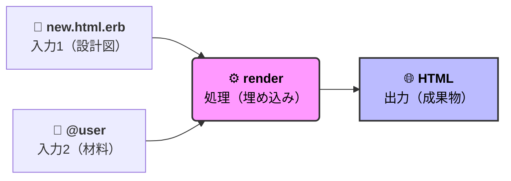
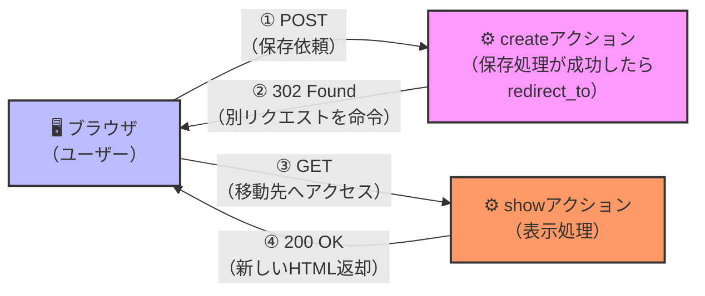

# ゴール
この記事では、Railsの`render`と`redirect_to`の違いと使い分けについてざっくり理解することを目指します⭐️
それぞれのメソッドがどのような役割を果たしているのかを理解し、適切な場面で使い分けられるようになることを目標とします🙋


# `render`とは？
`render`メソッドは、指定されたテンプレートから`@user`などのRubyコードを評価し、HTMLを生成してレスポンスとして返すために使用されます！



**`render`のコントローラーでの役割**
Railsコントローラにおいて、`render`は「レスポンスの作成」を意味します！

本来は、コントローラのアクションが終了すると、自動的に対応するビュー（テンプレート）がレンダリングされます。しかし、`render`メソッドを使用することで、特定のテンプレートを明示的に指定したり、異なるテンプレートをレンダリングしたりすることができます。

```ruby
def new
  # render :new が暗黙的に呼ばれる
end

def new
  render :show # newではなく、showテンプレートをレンダリング
end
```

### 処理のイメージ


<sub>参考：[renderとredirect の違い](https://qiita.com/january108/items/54143581ab1f03deefa1)より</sub>

- 現在のリクエスト内でビューをレンダリングし、HTMLを生成してレスポンスとして返す（**新しいリクエストが発生しない**）。そのため、ブラウザのURLも変わらない。
- 同じリクエスト内なので、コントローラで設定したインスタンス変数（`@user`など）をそのままビューで利用できる
- バリデーションエラー時など、データを保持したままフォームを再表示したい場合に便利

# `redirect_to`とは？
`redirect_to`メソッドは別ののURLにリクエストを再送信するようブラウザに指示します！
`render`メソッドではレスポンスを構成するときに使うビュー（または他のアセット）を指定していましたが、この点で根本的に異なります。



**`redirect_to`のコントローラーでの役割**
Railsコントローラにおいて、`redirect_to`は「別のURLへのリダイレクト」を意味します！
下記のように使用されることが一般的です。

```ruby
def create
  if @user.save
    redirect_to @user  # ユーザーの詳細ページへリダイレ
  else
    render :new        # バリデーションエラー時はnewテンプレートを
  end
end
```

### 処理のイメージ


<sub>参考：[renderとredirect の違い](https://qiita.com/january108/items/54143581ab1f03deefa1)より</sub>

- 新しいリクエストを発生させる（`302`リダイレクト）
- 新しいリクエストになるため、コントローラで設定したインスタンス変数は引き継がれない
- 主に、データの保存や更新が成功した後に、別のページへ移動させるために使用される

# まとめ
|                     | `render`                                    | `redirect_to`                             |
|---------------------|---------------------------------------------|-------------------------------------------|
| 目的                | ビューのレンダリング                        | 別のURLへのリダイレクト                  |
| リクエストの発生    | なし（同じリクエスト内で処理）              | あり（新しいリクエストが発生）            |
| インスタンス変数の利用 | 可能（同じリクエスト内で維持される）          | 不可（新しいリクエストになるため引き継がれない）  |
| 主な使用場面      | バリデーションエラー時のフォーム再表示など    | データ保存・更新後のページ移動など              |

# おわりに
`render`と`redirect_to`は、Railsアプリケーションでビューの表示やページ遷移を制御するための重要なメソッドです💪
それぞれぞれの役割と使い分けを理解し、適切に使い分けることでより効果的に開発を行なっていきたいと思います🧑‍💻

# 参考記事
https://railsguides.jp/layouts_and_rendering.html

https://qiita.com/january108/items/54143581ab1f03deefa1#redirect

https://zenn.dev/take_tech/articles/62468f3f149e5b

