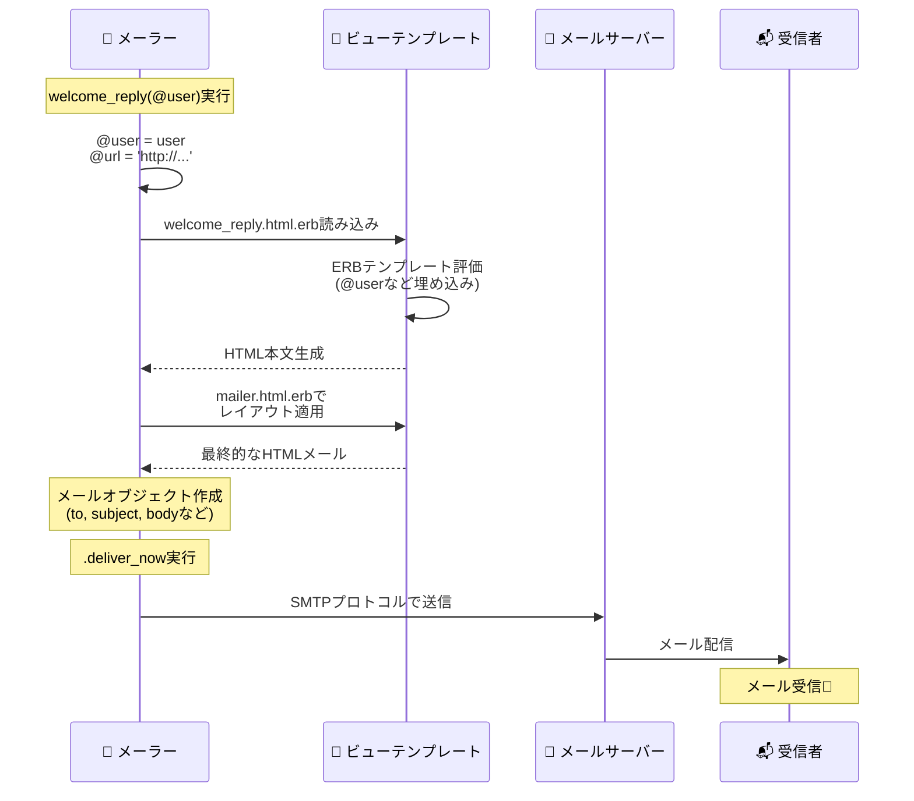

# ゴール
この記事では、Railsでなぜ簡単にメール送信できるようになっているのか、その仕組みをざっくり理解することを目指します⭐️
`Action Mailer`の基本的な概念と、メール送信の流れを理解し、全体像を把握することを目標とします🙋


# Action Mailerとは？
`Action Mailer`は、Railsフレームワークの一部であり、アプリケーションからメールを送信するための仕組みを提供します！
`Action Mailer`は「メーラー（mailer）」と呼ばれるクラスを使用して、メールの内容や送信先などを定義し、メールのテンプレートを使用してメールの本文を生成します✉️

**特徴**
- メーラークラスは`ActionMailer::Base`を継承し、メソッド（メーラーアクション）を定義する（**コントローラーに似た構造**）
- `ERB`テンプレートを使用してメールの本文を生成できる
- HTMLメールとテキストメールの両方をサポート
- 開発環境でメールの見た目を確認できる（プレビュー機能）

**Action Mailerの基本構造**
```
app/
├── mailers/
│   ├── application_mailer.rb      # 基底メーラークラス
│   └── user_mailer.rb              # ユーザー関連のメーラー
│
└── views/
    ├── layouts/
    │   └── mailer.html.erb         # メールレイアウト（HTML版）
    │   └── mailer.text.erb         # メールレイアウト（テキスト版）
    │
    └── user_mailer/
        ├── welcome_reply.html.erb  # HTMLメール本文
        └── welcome_reply.text.erb  # テキストメール本文

test/
└── mailers/
    ├── previews/
    │   └── user_mailer_preview.rb  # プレビュー用
    └── user_mailer_test.rb         # テスト

```

# メーラーとビューの作成
## メーラーを生成する
まず、メーラーを生成します。以下のコマンドを実行して、`UserMailer`というメーラーを作成します。

```bash
$ rails generate mailer User
```
生成されるファイル
| ファイルパス                          | 説明                         |
|--------------------------------------|------------------------------|
| `app/mailers/user_mailer.rb`        | メーラークラス                |
| `app/views/user_mailer/`            | メールテンプレートディレクト
| `test/mailers/user_mailer_test.rb`  | メーラーテスト                |
| `test/mailers/previews/user_mailer_preview.rb` | メーラープレビュー            |

`user_mailer.rb`を確認すると、以下の通り`ApplicationMailer`を継承したクラスが生成されています。

```ruby
class UserMailer < ApplicationMailer
end
```

`ApplicationMailer`は、`appication_mailer.rb`に定義されており、`ActionMailer::Base`を継承しています。
このクラスで、メールのデフォルト設定（送信元アドレスやレイアウトなど）を定義できます。

```ruby
class ApplicationMailer < ActionMailer::Base
  default from: 'from@example.com'
  layout 'mailer'
end
```

:::note info
`ActionMailer::Base`とは？
- Railsのメール送信機能を提供する基底クラス。すべてのメーラークラスはこのクラスを継承することで、メール送信に必要な機能を利用できるようになる。

`ActionMailer::Base`が提供する主な機能
- メール送信メソッド
  - `mail()` - メールを作成
  - `deliver_now` - 即座に送信
  - `deliver_later` - バックグラウンドジョブで送信
- 設定メソッド
  - `default` - デフォルト値の設定
  - `attachments` - 添付ファイル
  - `headers` - カスタムヘッダー
- テンプレート機能
  - ビューテンプレートの自動読み込み
  - レイアウトの適用
- コントローラーに似た機能
  - インスタンス変数をビューで使用可能
  - フィルター（before_action など）
:::

## メーラーを編集する
メーラークラスにメール送信のロジックを追加します！
以下は、ユーザー登録完了時に送信するウェルカムメールの例です。

```ruby
# app/mailers/user_mailer.rb
class UserMailer < ApplicationMailer
  def welcome_reply(user)
    @user = user
    @url  = 'http://example.com/login'
    mail(to: @user.email, subject: 'エンジニア学習サイトへようこそ！')
  end
end
```
- `welcome_reply`メソッドは、メール送信のためのアクションを定義
- `mail`メソッドで送信先や件名を指定
- インスタンス変数（`@user`や`@url`）は、ビューで使用可能
- テキスト版が必要な場合は、同様に`welcome_reply.text.erb`テンプレートを作成

## メーラービューを作成する
メールの本文を定義するために、対応するビューを作成します！（コントローラーのアクションに対応するビューを作成するのと似ていますね🙆）

作成場所ですが、`app/views/user_mailer/`ディレクトリ内に、以下のようにHTML版とテキスト版のテンプレートを作成します。

```erb
<!-- app/views/user_mailer/welcome_reply.html.erbの場合 -->
<h1><%= @user.name %>様、ようこそ！</h1>
<p>アカウントの登録が完了しました。</p>
<p>以下のURLからログインできます。</p>
<p><a href="<%= @url %>"><%= @url %></a></p
```

:::note warn
**`<header>`タグや`<body>`タグがないですが、なぜですか？**
- メールテンプレートは、`ApplicationMailer`で指定したレイアウト（`views/layouts/mailer.html.erb`）に自動的に組み込まれます。
- そのため、個々のテンプレートにはHTMLの基本構造を含める必要はありません。
:::

# メールの送信
メーラーとビューが準備できたら、実際にメールを送信してみましょう！
メール送信は、コントローラーやモデルなど、アプリケーションの任意の場所から行うことができます。

```ruby
# コントローラーの場合
class UsersController < ApplicationController
  def create
    @user = User.new(user_params)
    if @user.save
      # ユーザー登録成功時にウェルカムメールを送信
      UserMailer.welcome_reply(@user).deliver_now
      redirect_to @user, notice: 'ユーザーが作成されました。'
    else
      render :new
    end
  end
end
```
- `UserMailer.welcome_reply(@user).deliver_now`でメールを即座に送信
- `deliver_now`で同期的にメールを送信する
- 非同期に送信したい場合は、`deliver_later`を使用することも可能

# まとめ
**Railsメール送信の仕組み**



# 終わりに
簡単ですが、Railsの`Action Mailer`を使ったメール送信の仕組みについてまとめてみました！
もう少し詳細な設定やカスタマイズもRailsガイドに記載されていたので、必要に応じて確認したいと思います！

# 参考記事
https://railsguides.jp/action_mailer_basics.html

