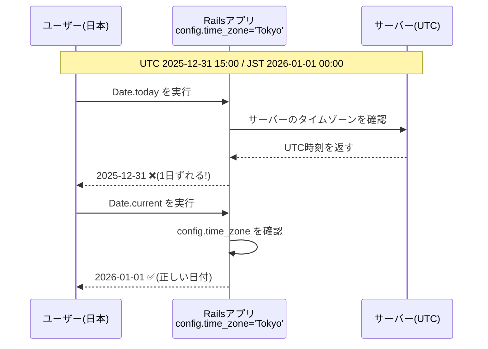

# 背景
Railsで開発し始めたばかりの頃に、先輩から「`Date.today`と`Date.current`の違いを理解して、使ってね」と教えられました。
しかし、教えてもらった当時はその違いはよくわかっていなかったです...😅
この記事では、`Date.today`と`Date.current`の違いについて、初心者の方向けにわかりやすく解説します！✍️


# `Date.today`とは？
`Date.today`は、Rubyの標準ライブラリで提供されているメソッドで、システムのローカルタイムゾーンに基づいて現在の日付を取得します！
つまり、**サーバーのタイムゾーン設定に依存**します。

**特徴**
- Rubyの標準メソッド
- サーバーのタイムゾーンを使用
- Railsで設定したタイムゾーン（`config.time_zone`）は考慮されない

# `Date.current`とは？
`Date.current`は、Railsが提供するメソッドで、Railsアプリケーションの設定に基づいて現在の日付を取得します！
具体的には、`config.time_zone`で設定されたタイムゾーンを考慮します。

**特徴**
- Rails独自のメソッド(ActiveSupportによって追加)
- アプリケーションのタイムゾーン設定(config.time_zone)を使用
- サーバーのタイムゾーンに依存しない

# 両者の違いまとめ
| メソッド | 　| 基準にする時間 | 特徴 |
| -------- | - | -------------- | ---- |
| `Date.today` | Ruby標準　| サーバーのタイムゾーン | Railsの設定は無視 |
| `Date.current` | Rails拡張 | アプリケーションのタイムゾーン設定 | `config.time_zone`を考慮 |

# Railsアプリケーションではどちらを使うべきか？
Railsアプリケーションでは、**`Date.current`を使用することが推奨**されます！

具体例で説明します。
例えば、サーバーのタイムゾーンがUTCに設定されており、Railsアプリケーションのタイムゾーンが`Tokyo`（JST）に設定されている場合を考えます。

```ruby
# config/application.rb
config.time_zone = 'Tokyo'
```

アプリでは、「お正月キャンペーン」として年明けの1月1日から特別な処理を行いたいとします。
もし`Date.today`を使用すると、サーバーのタイムゾーン(UTC)に基づいて日付が取得されるため、日本時間で1月1日になっていても、UTCではまだ12月31日のままです。
これにより、1月1日の年が変わった瞬間ではなく、1月1日の朝9時までキャンペーンが開始されないという問題が発生してしまいます😭



# 終わりに
この記事では、`Date.today`と`Date.current`の違いについて解説しました！
`Time.now`と`Time.current`の違いも同様の考え方が適用されるので、そちらもぜひ確認してみてください🙌
最後まで読んでいただき、ありがとうございました🍀
